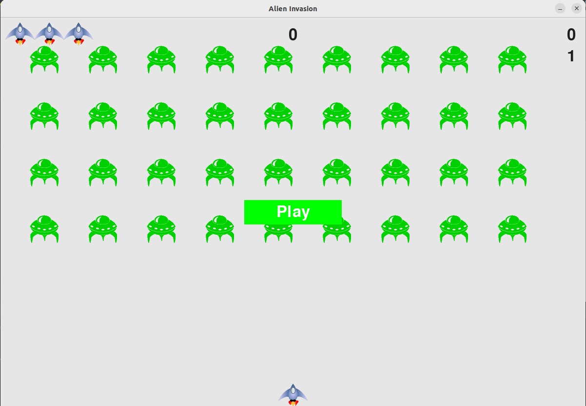

# Space Wars
This is a silly name for a silly project, __space wars__:). Anyway happy gaming.

This project is developed from the book **'Python Crash Course'**.
I had fun learning and coding this project. I tried to make it more fun,
by adding little sound effects in the game.

Like when the gamer hits play button, it makes this war starting sound.
And while shooing pew, pew, pew! :)

 __requirements.txt__ file.
requirement of **pygame** module.

## Game play
Are you ready to witness the game play for the **hardest game ever**!?

* Move left or right using left or right arrow key.
* Shoot with space key.
* Score progresses as the level progesses, and speed increases according to level.
* You have three live to win this war, will you loose or win, who knows?

### How to run?
* Clone this project.
* Install the only requirement(pygame)
* Then run the main.py file and have fun.

#### UI
* On the right score level.
* In the middle high score.
* On the left lives(three max)
